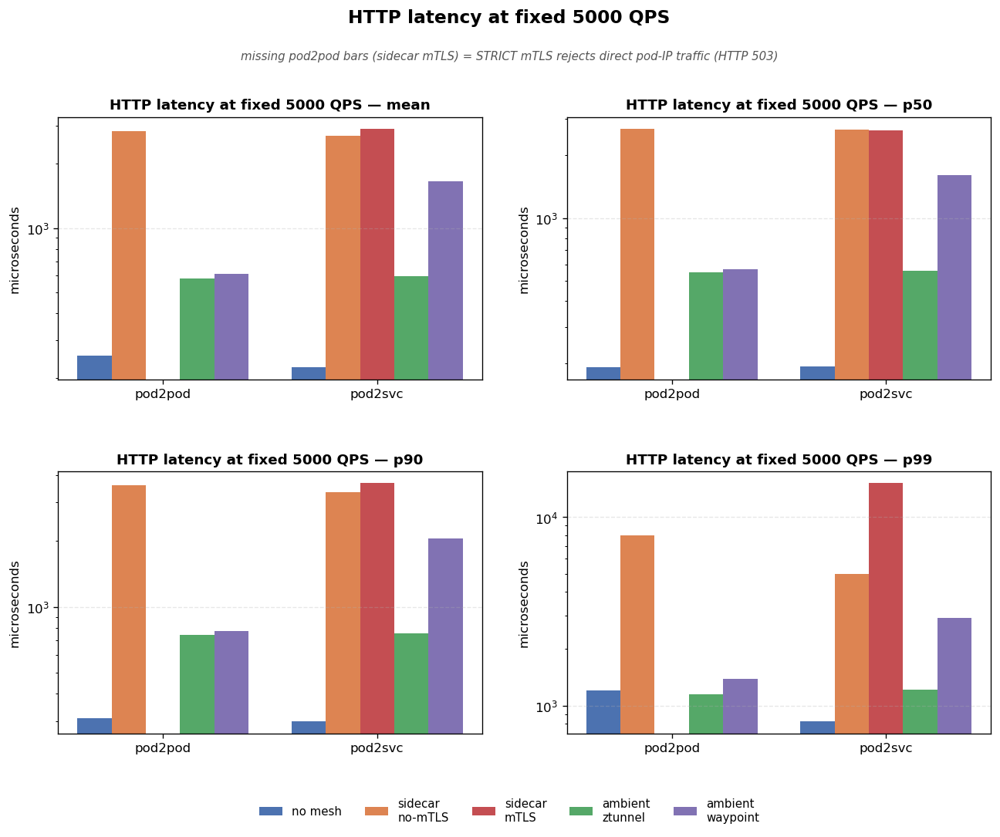
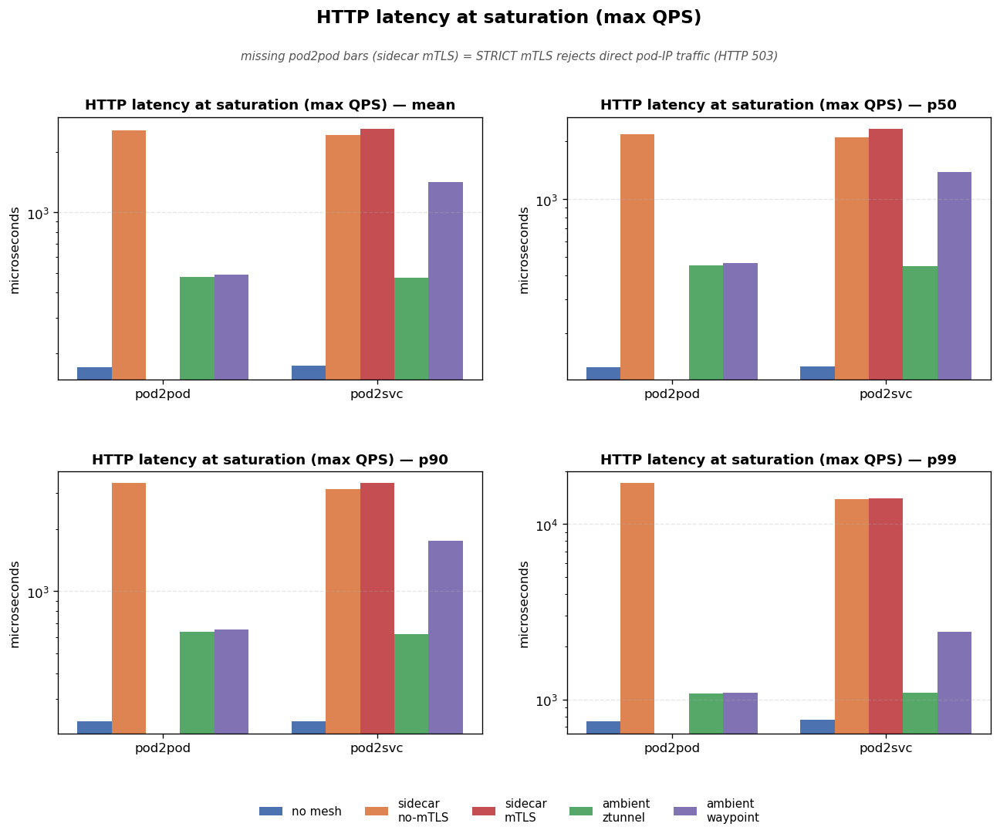
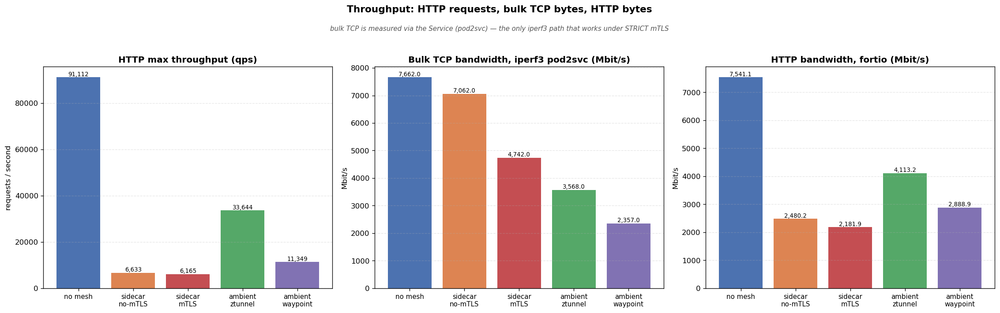
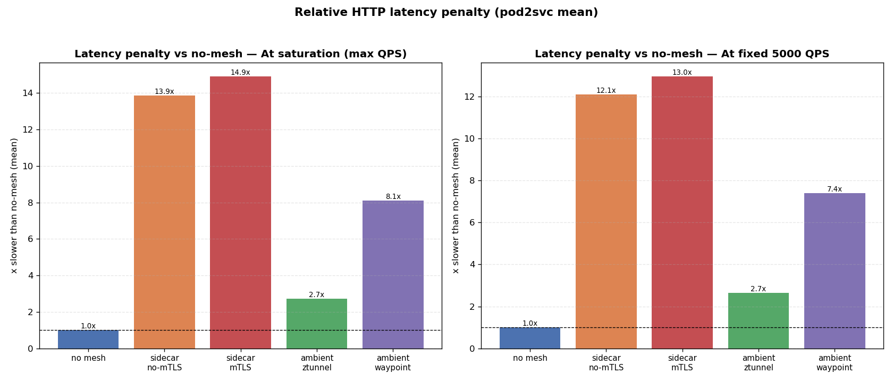
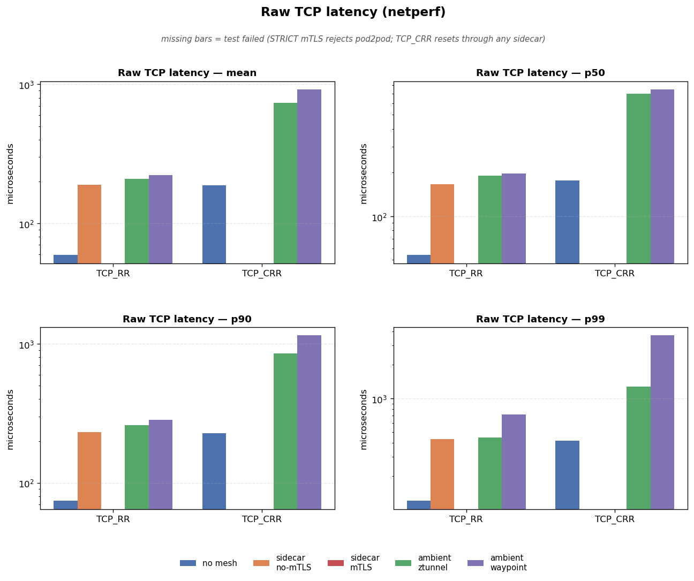

# Istio Service Mesh: Latency & Throughput Benchmark

> Benchmarks the data-plane cost of Istio's four operating modes — **sidecar** (with and without mTLS) and **ambient** (ztunnel L4 and waypoint L7) — against a **no-mesh baseline**, using raw TCP (netperf), HTTP (fortio), and bulk TCP (iperf3) workloads.

---

## Overview

Istio offers two data-plane architectures with very different performance profiles. This report quantifies that difference on a real Kubernetes cluster, measuring three distinct axes:

| Axis                     | Tool           | What it measures                                       |
| ------------------------ | -------------- | ------------------------------------------------------ |
| **Bulk throughput**      | iperf3 (`knb`) | Steady-state bytes/sec over a long-lived TCP stream    |
| **HTTP latency / req/s** | fortio         | Per-request latency (p50/p90/p99) and max requests/sec |
| **Raw TCP latency**      | netperf        | Round-trip µs per transaction (TCP_RR / TCP_CRR)       |

Each axis stresses a different part of the data plane, and — as shown below — the two architectures **invert** their ranking depending on which axis you look at.

---

## Summary of Findings

The headline result in one sentence:

> **On the Service path (pod2svc), ambient ztunnel is ~4.9× faster than sidecar on latency and ~5.5× better on request rate; the sidecar wins on raw bulk TCP, including via the Service — but pod2pod traffic is rejected under STRICT mTLS.**

| Test                                        | no mesh  | sidecar no-mTLS | sidecar mTLS  | ambient ztunnel | ambient waypoint |
| ------------------------------------------- | -------- | --------------- | ------------- | --------------- | ---------------- |
| HTTP latency (fixed 5000 qps, pod2svc mean) | 223.6 µs | 2,702.5 µs ❌   | 2,898.5 µs ❌ | 593.8 µs ⚠️     | 1,650.9 µs ⚠️    |
| HTTP max throughput (pod2svc qps)           | ~91,112  | ~6,633 ❌       | ~6,165 ❌     | ~33,644 ⚠️      | ~11,349 ⚠️       |
| HTTP bandwidth, fortio (Mbit/s)             | 7,541    | 2,480 ⚠️        | 2,182 ⚠️      | 4,113 ⚠️        | 2,889 ⚠️         |
| Bulk TCP bandwidth, iperf3 pod2svc (Mbit/s) | 7,662    | 7,062 ✅        | 4,742 ✅      | 3,568 ⚠️        | 2,357 ⚠️         |
| Bulk TCP bandwidth, iperf3 pod2pod (Mbit/s) | 7,503    | 7,297 ✅        | n/a\*         | 3,664 ⚠️        | 3,681 ⚠️         |
| Raw TCP_RR latency (pod2pod)                | 59 µs    | 190 µs          | n/a\*         | 208 µs          | 223 µs           |

Legend: ✅ near-baseline · ⚠️ moderate penalty · ❌ severe penalty · n/a\* = pod2pod is rejected under STRICT mTLS (see caveats).

**Key findings:**

1. **Ambient wins the request-oriented workload (Service path).** At fixed 5000 qps, ztunnel adds ~370 µs over baseline while sidecar adds ~2,675 µs. On max throughput, ztunnel sustains ~5.5× more requests/sec and ~1.9× more HTTP bandwidth than the sidecar.

2. **STRICT mTLS rejects pod2pod (direct pod-IP) traffic.** The sidecar requires mTLS to the destination's workload identity, which is Service/ServiceAccount-keyed — a raw pod IP has no resolvable identity. fortio returns HTTP 503, while iperf3/netperf hang and time out. Only Service (pod2svc) traffic works in `sidecar-mtls`.

3. **mTLS cost is real on the mean, larger on the tail.** Sidecar STRICT mTLS mean is ~7% slower than no-mTLS (2,898.5 vs 2,702.5 µs), but the fixed-QPS p99 is 15,112.5 µs vs 4,979.9 µs — the tail is worse and worth re-measuring (single-sample noise cannot be ruled out).

4. **Waypoint adds a clear L7 cost on the Service path.** pod2svc goes no-mesh 223.6 µs → ztunnel 593.8 µs → waypoint 1,650.9 µs, and its pod2pod stays ztunnel-only (~223 µs vs ztunnel 208 µs) — confirming the waypoint only intercepts Service traffic.

5. **Raw bulk TCP favors the sidecar, even under STRICT mTLS (via the Service).** iperf3 pod2pod loses only 3% with a DISABLE sidecar vs 51% with ztunnel; via the Service, the STRICT-mTLS sidecar keeps 4,742 Mbit/s vs ztunnel's 3,568 Mbit/s.

---

## Environment & Methodology

### Cluster

| Property      | Value                                     |
| ------------- | ----------------------------------------- |
| Kubernetes    | v1.31.1                                   |
| Istio         | 1.29.2                                    |
| Client node   | `g9-56core-1227`                          |
| Server node   | `g9-56core-1229`                          |
| CPU           | Intel(R) Xeon(R) CPU E5-2680 v4 @ 2.40GHz |
| Kernel        | 5.15.0-160-generic                        |
| CNI MTU       | 1500                                      |
| CNI           | Cilium                                    |
| Test duration | 20 s per test                             |

### Mesh modes under test

| Mode                 | Namespace                  | Config                                                                    |
| -------------------- | -------------------------- | ------------------------------------------------------------------------- |
| **no mesh**          | `benchmark`                | (none)                                                                    |
| **sidecar no-mTLS**  | `benchmark-sidecar-nomtls` | `istio-injection: enabled` + `PeerAuthentication` `DISABLE`               |
| **sidecar mTLS**     | `benchmark-sidecar-mtls`   | `istio-injection: enabled` + `PeerAuthentication` `STRICT` (see `setup/`) |
| **ambient ztunnel**  | `benchmark-ztunnel`        | `istio.io/dataplane-mode: ambient`                                        |
| **ambient waypoint** | `benchmark-waypoint`       | ambient + `istioctl waypoint apply --enroll-namespace` (L7)               |

### How each test runs

Every mode is measured the same way: one client pod (pinned to `g9-56core-1227`) and one server pod (pinned to `g9-56core-1229`), with a `Service` for the pod2svc path.

- **HTTP (fortio):** a `fortio server` on the server node; `fortio load` from the client. Two load levels — `-qps 0` (saturate) and `-qps 5000` (fixed, apples-to-apples) — and two targets — pod IP (`pod2pod`) and Service name (`pod2svc`).
- **Raw TCP (netperf):** a `netserver` on the server node; `netperf TCP_RR` (per-request round-trip on an established connection) and `TCP_CRR` (connect + request + response).
- **Bulk TCP (iperf3):** from the earlier `knb` run, `-ot tcp` — reported for both pod2pod and pod2svc (the Service path is the one that works under STRICT mTLS).

> **Ambient path note:** in ambient mode the L7 waypoint only intercepts _Service_ traffic. So for the waypoint mode, `pod2svc` is the waypoint path and `pod2pod` is a ztunnel-only control.

All pods carry `imagePullSecrets: reg-pegah-credit`; image versions are pinned in `k8s-bench-suite/config.sh` (netperf, fortio, monitor).

---

## Test 1 — HTTP Latency & Throughput (fortio)

### Latency at fixed 5000 QPS (apples-to-apples)

Mean / p50 / p90 / p99 in **microseconds**, on the Service path (`pod2svc`) — the only path that works in every mode (STRICT mTLS rejects pod2pod):

| Mode             | mean    | p50     | p90     | p99      |
| ---------------- | ------- | ------- | ------- | -------- |
| no mesh          | 223.6   | 193.5   | 298.0   | 822.9    |
| sidecar no-mTLS  | 2,702.5 | 2,645.8 | 3,337.9 | 4,979.9  |
| sidecar mTLS     | 2,898.5 | 2,644.2 | 3,681.8 | 15,112.5 |
| ambient ztunnel  | 593.8   | 557.2   | 756.7   | 1,220.8  |
| ambient waypoint | 1,650.9 | 1,613.0 | 2,059.8 | 2,928.8  |



### Latency at saturation (max QPS)

Each mode driven to its own ceiling. Latency here includes queueing, so the gap is partly a _throughput_ effect.

| Mode             | mean    | p50     | p90     | p99      |
| ---------------- | ------- | ------- | ------- | -------- |
| no mesh          | 173.9   | 134.6   | 234.2   | 761.6    |
| sidecar no-mTLS  | 2,411.5 | 2,099.4 | 3,122.8 | 13,927.1 |
| sidecar mTLS     | 2,594.3 | 2,315.8 | 3,333.5 | 14,091.3 |
| ambient ztunnel  | 475.0   | 446.3   | 622.7   | 1,093.1  |
| ambient waypoint | 1,409.2 | 1,377.4 | 1,751.0 | 2,419.8  |



### Throughput

| Mode             | max HTTP qps (pod2svc) | bulk TCP Mbit/s, iperf3 pod2svc |
| ---------------- | ---------------------- | ------------------------------- |
| no mesh          | 91,112                 | 7,662                           |
| sidecar no-mTLS  | 6,633                  | 7,062                           |
| sidecar mTLS     | 6,165                  | 4,742                           |
| ambient ztunnel  | 33,644                 | 3,568                           |
| ambient waypoint | 11,349                 | 2,357                           |



### Relative latency penalty vs no-mesh



### Findings

- **Per-request cost is the sidecar's weakness.** On the Service path, the sidecar adds ~2,675 µs of L7 processing (`app → envoy → envoy → app`), while ztunnel adds only ~370 µs of L4 tunneling.
- **mTLS cost is modest, not free.** Sidecar STRICT mTLS is ~7% slower than no-mTLS on the Service path — the proxy hop dominates, not the handshake/encryption.
- **Throughput ordering flips by protocol.** HTTP req/s and HTTP bandwidth both rank `no mesh > ztunnel > waypoint > sidecar`, but raw pod2pod TCP Mbit/s ranks `no mesh > sidecar > ztunnel ≈ waypoint`. The sidecar's raw-TCP edge only holds in no-mTLS mode (STRICT mTLS rejects pod2pod).

---

## Test 2 — Raw TCP Latency (netperf)

Mean / p50 / p90 / p99 in **microseconds**.

| Mode             | TCP_RR mean | p50   | p90   | p99   | TCP_CRR mean |
| ---------------- | ----------- | ----- | ----- | ----- | ------------ |
| no mesh          | 59.2        | 54.0  | 74.0  | 120.0 | 187.7        |
| sidecar no-mTLS  | 190.2       | 166.0 | 231.0 | 431.0 | n/a          |
| sidecar mTLS     | n/a         | n/a   | n/a   | n/a   | n/a          |
| ambient ztunnel  | 208.3       | 191.0 | 259.0 | 444.0 | 737.1        |
| ambient waypoint | 223.1       | 197.0 | 283.0 | 720.0 | 917.1        |



### Findings

- **ztunnel's TCP_RR penalty is modest** vs no-mesh, confirming the L4 path is cheap per transaction.
- **TCP_CRR (connection setup) is where ambient hurts**: the HBONE/waypoint path pays per connection establishment.
- **netperf is unusable through an Envoy sidecar** (see [caveats](#caveats)) — a tool limitation, not a mesh failure.

---

## Test 3 — Bulk TCP Throughput (iperf3 / knb)

| Mode             | pod2pod TCP (Mbit/s) | vs no-mesh | pod2svc TCP (Mbit/s) |
| ---------------- | -------------------- | ---------- | -------------------- |
| no mesh          | 7,503                | 1.00x      | 7,662                |
| sidecar no-mTLS  | 7,297                | 0.97x      | 7,062                |
| sidecar mTLS     | n/a                  | n/a        | 4,742                |
| ambient ztunnel  | 3,664                | 0.49x      | 3,568                |
| ambient waypoint | 3,681                | 0.49x      | 2,357                |

### Findings

- **A DISABLE sidecar loses only ~3% of raw pod2pod bulk bandwidth.** Envoy's TCP proxy forwards bytes with minimal per-packet overhead once the connection is up.
- **Ambient loses ~half** of raw pod2pod bulk bandwidth (ztunnel 51%) — the HBONE tunnel adds per-byte cost that single-stream iperf3 exposes.
- **Via the Service, the sidecar keeps its bulk-TCP edge even under STRICT mTLS** — `sidecar-mtls` pod2svc is 4,742 Mbit/s vs ztunnel's 3,568 Mbit/s. The pod2pod cell is `n/a` only because STRICT mTLS rejects direct pod-IP traffic.

---

## Test 4 — HTTP Bandwidth (fortio)

fortio with a 65536-byte response, at max QPS, through the Service (`pod2svc`). This is the only bandwidth metric that works across **all** modes, including the STRICT-mTLS sidecar — the proxy for "bandwidth through the mesh" when iperf3 cannot be used.

| Mode             | HTTP bandwidth (Mbit/s) | vs no-mesh |
| ---------------- | ----------------------- | ---------- |
| no mesh          | 7,541                   | 1.00x      |
| sidecar no-mTLS  | 2,480                   | 0.33x      |
| sidecar mTLS     | 2,182                   | 0.29x      |
| ambient ztunnel  | 4,113                   | 0.55x      |
| ambient waypoint | 2,889                   | 0.38x      |

### Findings

- **Sidecar STRICT mTLS has a measurable HTTP bandwidth** here, whereas its iperf3 number is unmeasurable — this is the comparison to use for the mTLS mode.
- Ordering roughly tracks the latency/throughput results: no mesh > ztunnel > waypoint > sidecar, because HTTP bandwidth is L7-proxy-bound, not raw-byte-bound.

---

## Caveats & Validity

These results were produced by an automated harness; the following limitations apply and were verified during an audit of the raw data.

### Tool incompatibilities (not mesh failures)

- **STRICT mTLS rejects pod2pod (direct pod-IP) traffic.** Under `PeerAuthentication: STRICT`, the sidecar must establish mTLS to the destination workload's identity, which is keyed by Service/ServiceAccount — a raw pod IP has no resolvable identity. fortio returns HTTP 503, while iperf3/netperf hang and time out. Only Service (pod2svc) traffic works, so pod2pod metrics are `n/a` for `sidecar-mtls`. This is expected Istio behavior, not a harness bug.
- **netperf TCP_CRR through a sidecar (even DISABLE) gets `Connection reset by peer`** — its rapid connect/close cycle breaks Envoy's connection handling. Reported as `n/a`.

### Fixed during the audit

- **fortio percentile bug.** At fixed QPS, fortio emits an `Aggregated Sleep Time` histogram whose `# target` percentile lines _precede_ the function-time percentiles; the original parser grabbed sleep-time, not latency. Fixed by scoping percentiles to the `Aggregated Function Time` block. (Max-QPS runs were unaffected — no sleep block at `-qps 0`.)
- **Metadata detection against a scratch image.** With `-ot http`, CPU/kernel detection ran against the scratch fortio image (no `grep`/`uname`). Fixed to use the always-deployed monitor pod.
- **Failed-test evidence.** The harness used to discard pod logs on failure; it now captures them under `raw-*/` so a failure mode can be audited.

### Remaining limitations

- **Single 20 s run per mode** — no cross-run variance. Per-request percentiles capture within-run distribution, but mode-level numbers are one sample.
- **Max-QPS latency is at saturation** — each mode at its own ceiling. The fixed-5000-qps pass provides the apples-to-apples comparison; both are reported. Note the fixed-QPS point is close to the sidecar's own ceiling (~6.5k qps), so its "fixed" latency still includes some queueing; run a lower QPS point for a cleaner per-request number.
- **mTLS p99 is a single-sample tail.** The fixed-QPS p99 for sidecar-mTLS (15,112.5 µs) is ~3x the no-mTLS p99 (4,979.9 µs), but the max-QPS p99s are roughly equal — this may be noise and needs a repeat run to confirm.
- **CPU/RAM are node-level** (monitor pods read host `/proc`), not per-pod, and include the benchmark pods' own CPU.

---

## Raw Data

Results live under `results/`, with one folder per mode plus the report and plots at the root:

```
results/
  REPORT.md                       # this report
  comparison.txt                  # text comparison table
  knb-throughput.json             # iperf3 bulk bandwidth (extracted from knb)
  plots/                          # PNG plots referenced above
  <mode>/                         # one folder per mode
    bandwidth.knbdata             # knb bulk-throughput report
    latency-maxqps.json           # max-QPS run (netperf + fortio)
    latency-fixed5000.json   # fixed-QPS run (fortio)
    raw-maxqps/                   # *.log, *.result, cpu/ram metrics, env
    raw-fixed5000/
```
